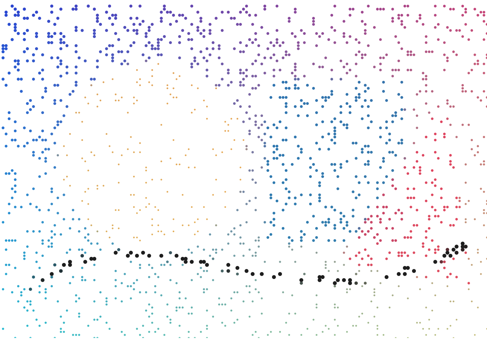
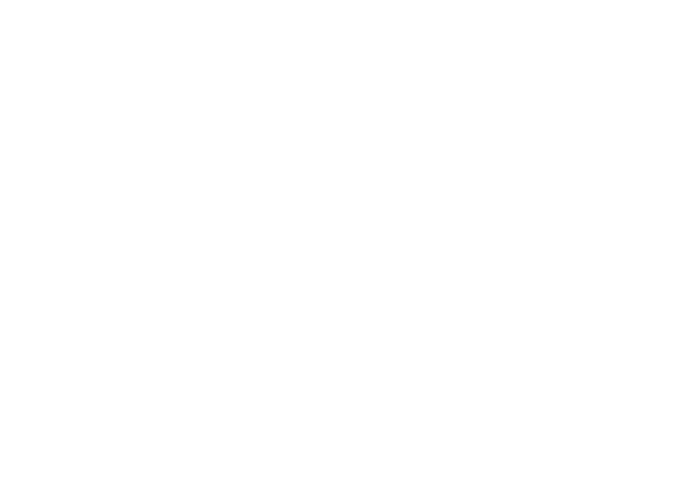
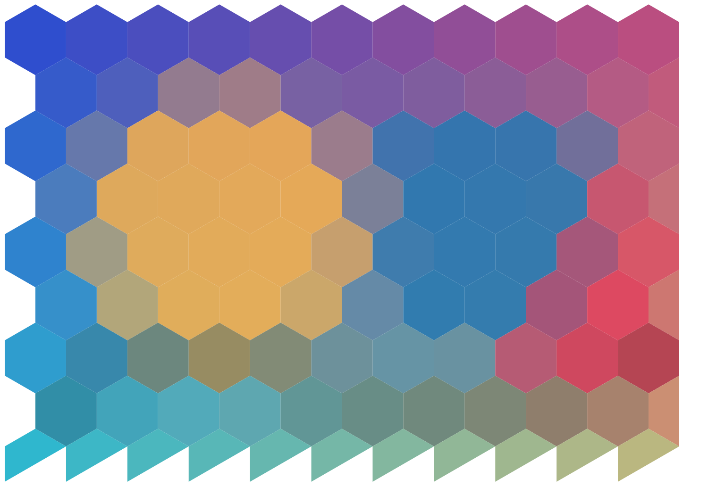
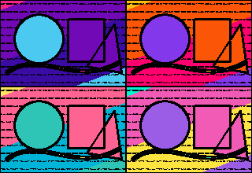
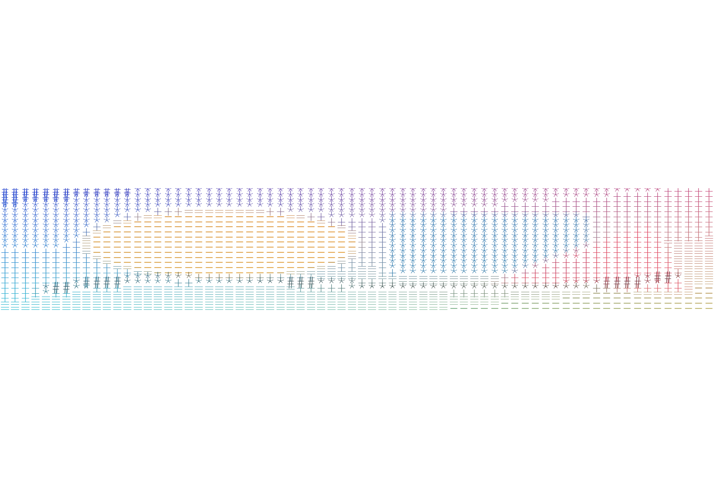

# ImageArtR

[](https://github.com/ZSRNOG/ImageArtR/actions/workflows/R-CMD-check.yaml)
[](LICENSE)
[](https://www.r-project.org/)
[](#main-functions)

`ImageArtR` is an R package for turning ordinary images into artistic graphics.
It reads local files, URLs, `magick-image` objects, and `imager::cimg` objects,
then returns a consistent `image_art` S3 object that can be printed, plotted,
summarized, and saved.

The package is designed for users who want image art workflows without leaving
R:

- Unified input and preprocessing through `read_art_image()` and
  `preprocess_image()`.
- Circle packing, mosaics, outlines, sketches, stippling, halftone, pop art,
  duotone, and ASCII styles.
- `ggplot2` outputs for modifiable vector-style graphics and `magick` outputs
  for raster-style effects.
- `save_image_art()` for PNG, JPEG, TIFF, SVG, PDF, TXT, and HTML output.
- Batch conversion with failure logs through `batch_image_artify()`.
- Built-in example image for reproducible tests, examples, and vignettes.

## Installation

Install from GitHub after publishing:

```r
install.packages("remotes")
remotes::install_github("ZSRNOG/ImageArtR")
```

Or install the local source directory without building a tarball:

```r
devtools::install(
  "C:/Users/zsr/Documents/ImageArtR",
  build = FALSE,
  upgrade = "never",
  dependencies = FALSE
)
```

This local-install form avoids copying deep Codex `.git/refs/codex` metadata on
Windows.

## Quick Start

```r
library(ImageArtR)

img <- read_art_image(system.file(
  "extdata",
  "example.png",
  package = "ImageArtR"
))

circle <- image_circle_art(img, n = 1000, seed = 123)
mosaic <- image_mosaic_art(img, tile_size = 12)
outline <- image_outline(img, method = "sobel")
sketch <- image_sketch(img, style = "pencil")

plot(circle)
plot(mosaic)
plot(outline)
plot(sketch)
```

Save a file only when requested:

```r
save_image_art(circle, "circle-art.png", overwrite = TRUE)
save_image_art(image_ascii_art(img, width = 70), "ascii-art.txt", overwrite = TRUE)
```

## Gallery

The gallery below was generated from the package example image with
`ImageArtR` functions. The images are saved in
[`gallery/readme`](gallery/readme).

| Stipple | Halftone |
| --- | --- |
|  |  |

| Hex mosaic | Pop art |
| --- | --- |
|  |  |

| Duotone | ASCII art |
| --- | --- |
|  |  |

## Main Functions

- `read_art_image()`: read paths, URLs, `magick-image`, and `imager::cimg`
  inputs.
- `preprocess_image()`: resize, crop, grayscale, normalize, blur, contrast, and
  transparent-background handling.
- `image_circle_art()`: non-overlapping circle packing art.
- `image_mosaic_art()`: square, circle, or hexagon tile mosaics.
- `image_hex_mosaic()`: dedicated regular hexagon mosaic.
- `image_stipple_art()`: density, random, grid, or edge-weighted stippling.
- `image_halftone()`: grayscale, color, or CMYK-style halftone marks.
- `image_pop_art()`: multi-panel posterized pop art with built-in palettes.
- `image_duotone()`: two-color tonal interpolation in RGB or Lab space.
- `image_ascii_art()`: text, `ggplot2`, or HTML ASCII art.
- `image_outline()`: Sobel, Laplacian, or approximate Canny-style outlines.
- `image_sketch()`: line, pencil, or cartoon sketches.
- `extract_image_palette()` and `plot_image_palette()`: dominant color
  extraction and palette visualization.
- `image_artify()`: unified style dispatcher.
- `batch_image_artify()`: sequential batch conversion with success/error logs.
- `save_image_art()`: save `image_art` objects to graphics, text, or HTML.

Use `list_art_styles()` for a compact overview of all supported styles.

## Style Examples

```r
img <- read_art_image(system.file("extdata", "example.png", package = "ImageArtR"))

styles <- list(
  stipple = image_stipple_art(img, n = 8000, color = "original", seed = 123),
  halftone = image_halftone(img, cell_size = 10, mode = "grayscale"),
  hex_mosaic = image_hex_mosaic(img, hex_size = 12),
  pop_art = image_pop_art(img, panels = 4, seed = 123),
  duotone = image_duotone(img, shadow = "#172A3A", highlight = "#F4D35E"),
  ascii = image_ascii_art(img, width = 80, output = "ggplot")
)

lapply(styles, plot)
```

Unified dispatch works the same way:

```r
result <- image_artify(
  img,
  type = "stipple",
  n = 3000,
  color = "original",
  seed = 123
)

plot(result)
```

## Documentation

- [vignettes/getting-started.Rmd](vignettes/getting-started.Rmd): first steps.
- [vignettes/circle-packing-art.Rmd](vignettes/circle-packing-art.Rmd): circle
  packing art.
- [vignettes/mosaic-art.Rmd](vignettes/mosaic-art.Rmd): regular mosaics.
- [vignettes/stippling-and-halftone.Rmd](vignettes/stippling-and-halftone.Rmd):
  stippling and halftone.
- [vignettes/geometric-mosaics.Rmd](vignettes/geometric-mosaics.Rmd): hex
  mosaics.
- [vignettes/pop-art-and-duotone.Rmd](vignettes/pop-art-and-duotone.Rmd): pop
  art and duotone.
- [vignettes/ascii-art.Rmd](vignettes/ascii-art.Rmd): ASCII text and HTML
  output.
- [vignettes/performance.Rmd](vignettes/performance.Rmd): performance notes.

## Performance Notes

Use `max_dimension` to downsample large images before conversion. High point
counts in stippling, small cell sizes in halftone or hex mosaics, and regional
mean/median color sampling are the main cost drivers. These are the best future
targets for Rcpp optimization.

## Author

Zhou Shirong  
<zsrnog@yeah.net>

## License

MIT.
